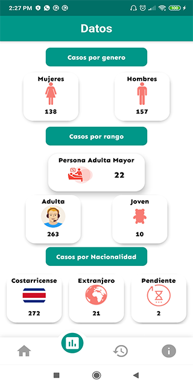
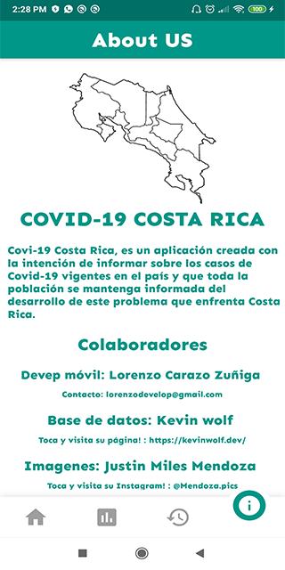

# Covid-19-CR
Aplicación personal encargada de llevar un control de todos los casos de coivd-19 en Costa Rica.

# Video ilustrativo.

# Información.

Covid-19 CR es un proyecto personal desarrollado en flutter y Dart, el cual se encarga de llevar registros de todos los casos activos, no activos, por genero, rango de edad de toda Costa Rica, mediante el consumo de servicios Rest.

# Fotos 
 

